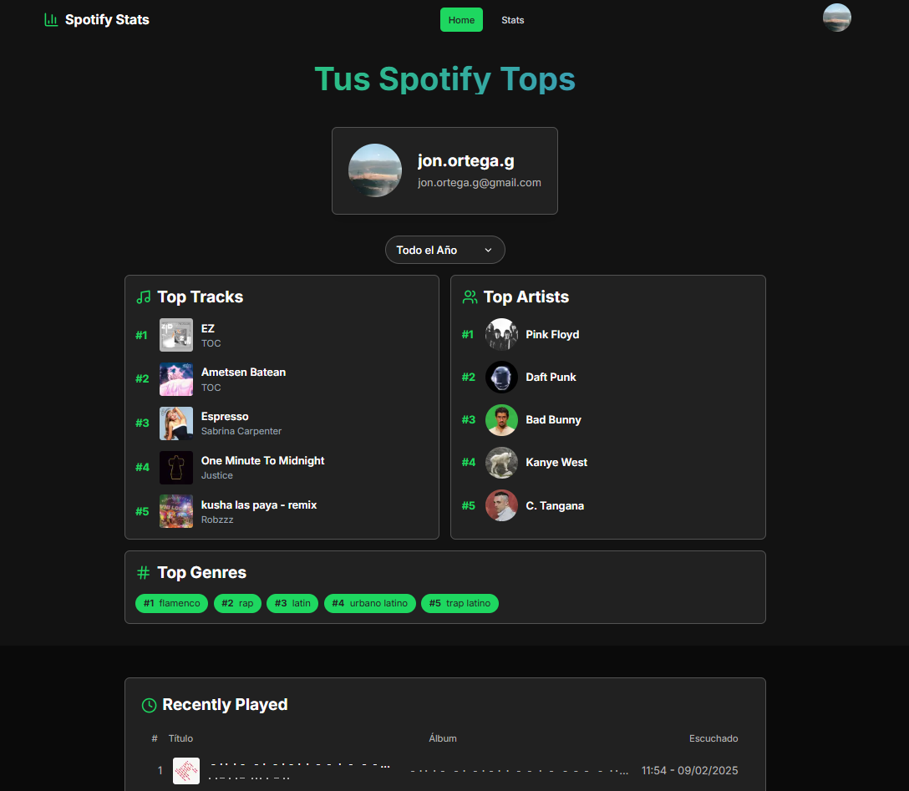
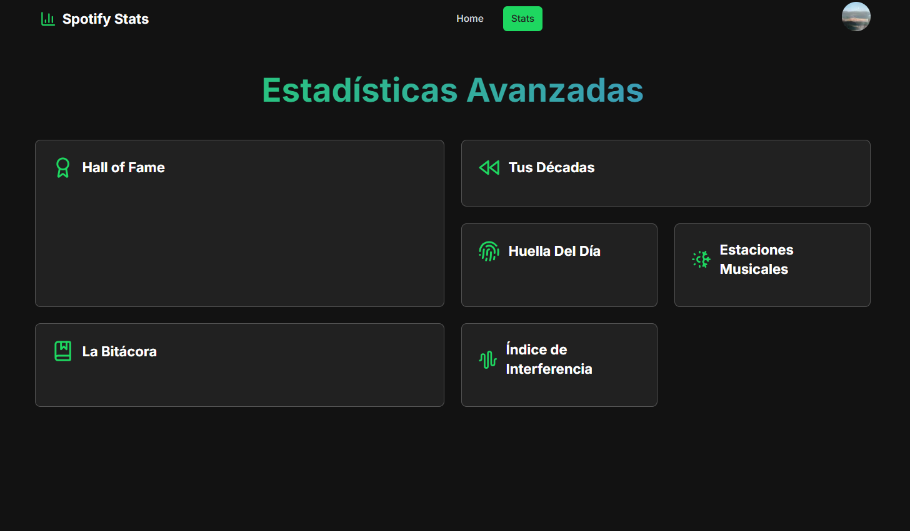
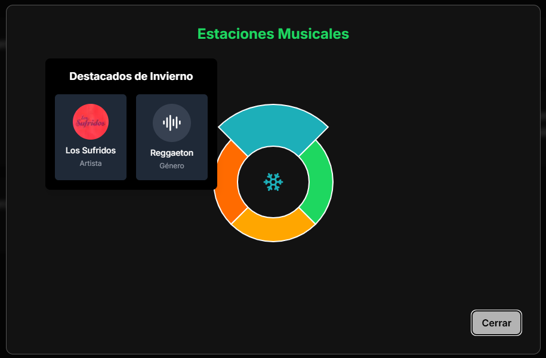
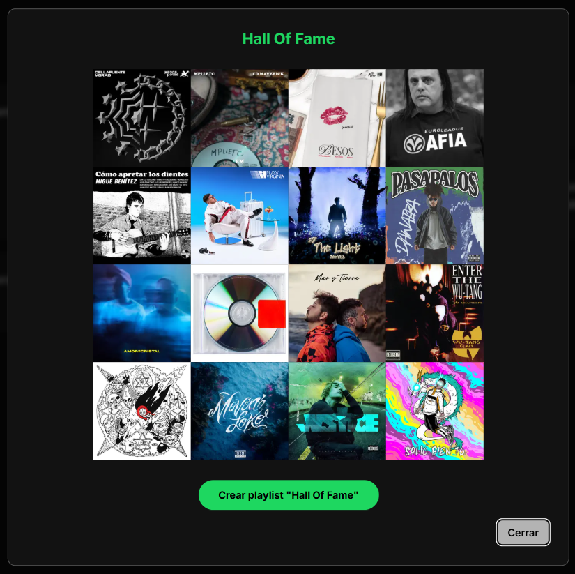
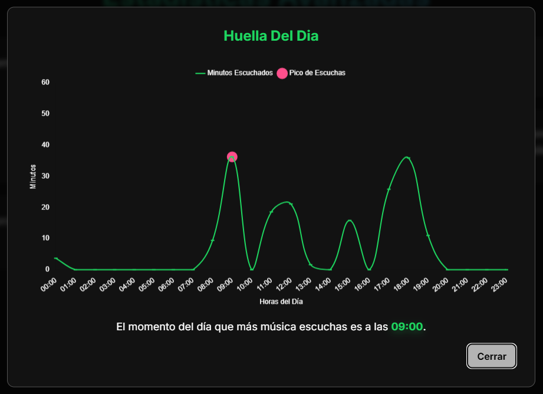
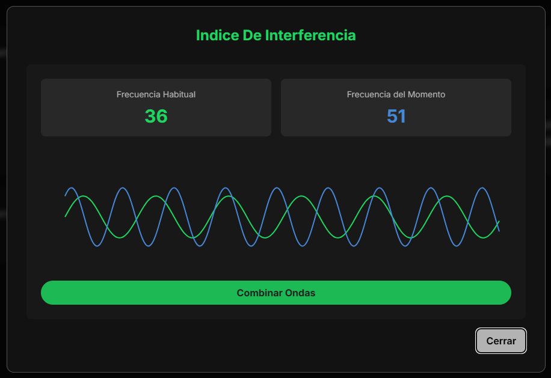
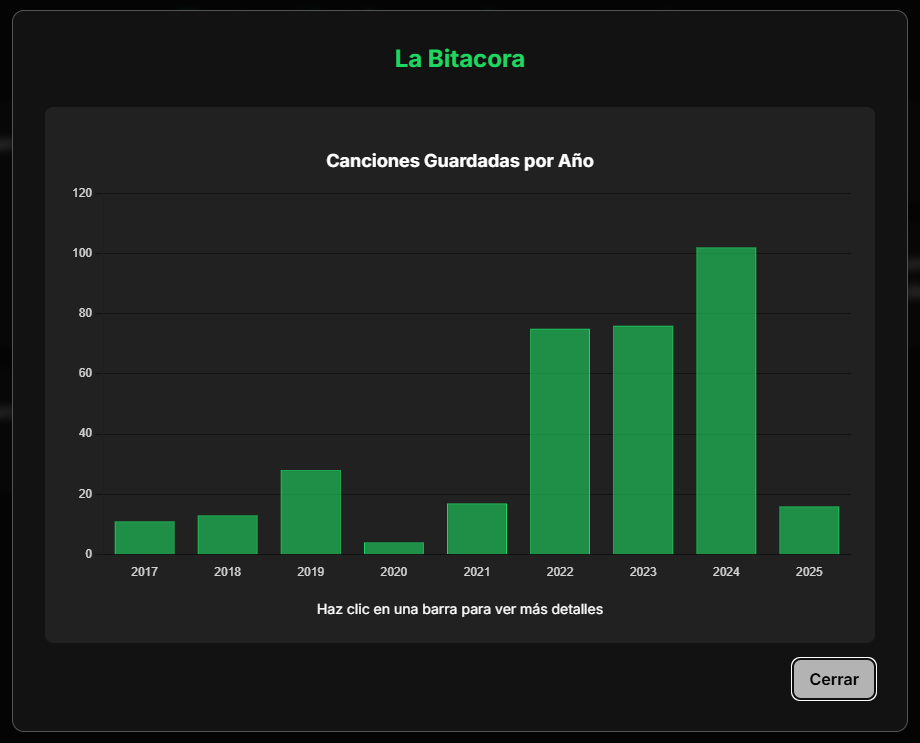
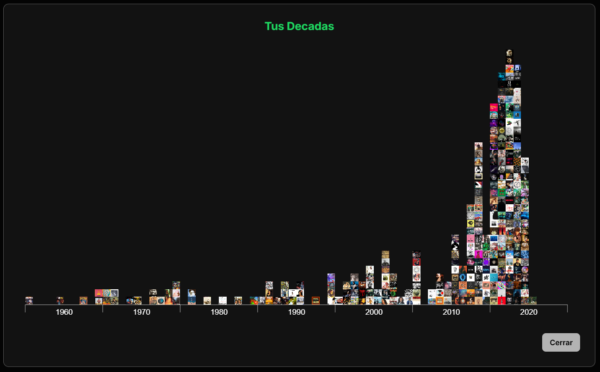

<h1 align="center">TFG-app-Spotify</h1>

  Proyecto del Trabajo de Fin de Grado (TFG): Aplicación web para visualizar estadísticas personalizadas de Spotify usando Next.js. <a href="https://github.com/jonortega/TFG-memoria">Memoria del TFG</a>

   &nbsp;
   &nbsp;
   &nbsp;
   &nbsp;
  

---

## Descripción General
**TFG-app-Spotify** es una aplicación web que permite a los usuarios visualizar estadísticas avanzadas y originales sobre su actividad en **Spotify**.  
Utiliza **Next.js 15**, **React 19**, y la **Spotify Web API** para obtener datos en tiempo real, ofreciendo gráficos interactivos y una interfaz optimizada.

---

## Demo: **[Prueba la aplicación aquí](https://tfg-app-spotify.vercel.app/)** 🔗
 
---

## Funcionalidades
✅ **Inicio de sesión con Spotify** mediante OAuth 2.0  
✅ **Visualización de estadísticas en gráficos interactivos**  
✅ ...

---

## Capturas de Pantalla

### Login

  

---

### Home y Stats

| Home (Stats Básicas)                                      | Stats (Stats Avanzadas)                                     |
| --------------------------------------------------------- | ----------------------------------------------------------- |
|  |  |

---

### Stats: Estadísticas Avanzadas

| **Estaciones Musicales**                                                                  | **Hall of Fame**                                                          |
| ----------------------------------------------------------------------------------------- | ------------------------------------------------------------------------- |
|  |  |

| **Huella del Día**                                                            | **Índice de Interferencia**                                                                     |
| ----------------------------------------------------------------------------- | ----------------------------------------------------------------------------------------------- |
|  |  |

| **La Bitácora**                                                                     | **Tus Décadas Out**                                                             |
| ----------------------------------------------------------------------------------- | ------------------------------------------------------------------------------- |
|  |  |

---

## Stack Tecnológico

| Tecnología          | Versión |
| ------------------- | ------- |
| **Next.js**         | 15.1.2  |
| **React**           | 19.0.0  |
| **TypeScript**      | 5.0.0   |
| **Tailwind CSS**    | 3.4.1   |
| **Node.js**         | 22.12.0 |
| **Jest**            | 29.7.0  |
| **Spotify Web API** | v1      |
| **pnpm**            | -       |
| **Vercel**          | -       |
| **ESLint**          | -       |

---

## 🤝 Contribuir
Si quieres mejorar el proyecto:

1. **Haz un fork** del repo
2. Crea una **nueva rama** (`feature/nueva-funcionalidad`)
3. **Haz un PR** explicando los cambios

---

## 📩 Contacto
Si tienes preguntas, puedes contactarme en:  
💼 **[LinkedIn: Jon Ortega](https://linkedin.com/in/jonortega)**

## 📜 Licencia
Este proyecto está licenciado bajo la **MIT License**. Consulta el archivo [LICENSE](./LICENSE) para más detalles.

